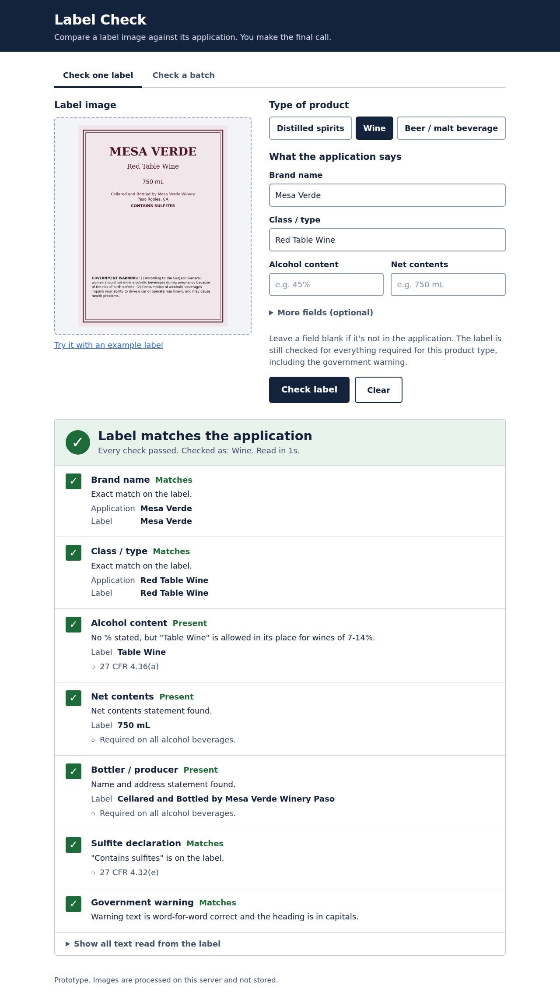

# Label Check — AI-assisted alcohol label verification

A prototype that helps TTB compliance agents check a label image against its
COLA application. It reads the label with OCR, compares each field, checks the
government health warning word for word, and returns a plain checklist:
**Matches**, **Needs review**, or **Does not match** — with the reason for each.

The agent always makes the final call. The tool handles the routine matching
so agents can spend their time on the judgment calls.

**Live demo:** _<add your deployed URL here>_



Batch mode: [docs/screenshot-batch.png](docs/screenshot-batch.png)

## What it does

- **Check one label** — upload an image, type the application values, get a
  result in about 1–2 seconds.
- **Check a batch** — choose many label images plus one CSV of application
  data; results stream in as each label finishes, failures sort to the top,
  and the results download as a CSV.
- **Fields checked:** brand name, class/type, alcohol content (with proof
  cross-check), net contents (unit-aware: mL, cL, L, fl oz), bottler/producer,
  country of origin, and the government warning (always).
- **Rules by product type** (distilled spirits, wine, beer/malt beverage),
  based on TTB's regulations in 27 CFR parts 4, 5, and 7. Required elements
  are checked on the label even when the application field is blank: e.g. a
  spirits label with no net contents fails; a wine labeled "Table Wine" may
  omit the % (27 CFR 4.36); a beer may omit alcohol content, but may not use
  "ABV" in it (27 CFR 7.65); an "Imported by" label needs a country of origin.
- **Handles imperfect photos:** straightens tilted images, corrects sideways
  or upside-down photos, and evens out uneven lighting and glare.

## Run it

### Option A — Docker (recommended; matches deployment)

```bash
docker build -t label-check .
docker run -p 8000:8000 label-check
```

Open http://localhost:8000 and click **Try it with an example label**.

### Option B — Local Python

Requires Python 3.10+ and the Tesseract OCR engine.

```bash
# 1. Install Tesseract
#    macOS:          brew install tesseract
#    Ubuntu/Debian:  sudo apt-get install tesseract-ocr
#    Windows:        https://github.com/UB-Mannheim/tesseract/wiki  (add it to PATH)

# 2. Install Python packages
python -m venv .venv
source .venv/bin/activate          # Windows: .venv\Scripts\activate
pip install -r requirements.txt

# 3. Create the sample labels, then start the app
python samples/generate_samples.py
python app.py                      # http://localhost:8000
```

### Run the tests

```bash
python -m unittest discover -s tests -t .
```

46 tests: unit tests for every matching and product-type rule, plus end-to-end tests that run
real OCR on all sample labels through the HTTP API and assert each one gets
the expected verdict in under 5 seconds.

## Try it

`samples/output/` contains twelve generated labels, each covering a scenario
from the stakeholder interviews, and `applications.csv` with their
application data. For batch mode, download **sample labels with their CSV**
from the batch tab, unzip, then choose all the images and the CSV.

| Label | Scenario | Expected |
|---|---|---|
| 01_old_tom_compliant | The sample label from the brief | Matches |
| 02_stones_throw_case | Label says `STONE'S THROW`, application says `Stone's Throw` | Matches |
| 03_vodka_wrong_abv | Application 45%, label 40% | Does not match |
| 04_rum_titlecase_warning | `Government Warning:` in title case | Does not match |
| 05_wine_reworded_warning | Warning statement reworded | Does not match |
| 06_old_tom_bad_photo | Tilted photo, uneven light, glare | Matches |
| 07_ipa_no_warning | No government warning | Does not match |
| 08_bourbon_heading_not_bold | Correct warning but heading not bold | Needs review |
| 09_table_wine_no_abv | Wine with no % but "Red Table Wine" designation | Matches |
| 10_lager_abv_abbreviation | Beer label says "4.8% ABV" | Does not match |
| 11_gin_missing_net_contents | No net contents; application field blank too | Does not match |
| 12_tequila_import_no_country | "Imported by" with no country of origin | Does not match |

### Batch CSV format

One row per label, matched to images by file name (case-insensitive). Only
`filename` is required. `beverage_type` is `spirits`, `wine`, or `beer`; if
it's missing, only the rules common to all products run. Blank fields aren't
compared, but required elements are still checked on the label. Extra columns
are ignored.

```csv
filename,beverage_type,brand_name,class_type,alcohol_content,net_contents,bottler,country_of_origin
old_tom.jpg,spirits,OLD TOM DISTILLERY,Kentucky Straight Bourbon Whiskey,45%,750 mL,"Old Tom Distillery, Bardstown, KY",
```

A blank template is at `static/template.csv` (also downloadable in the app).

## Deploy

The app is a single Docker container with no external service dependencies.

- **Render (easiest):** Dashboard > **New > Blueprint** > choose this repo.
  `render.yaml` sets everything up. Use the Starter plan: the free plan has
  0.1 CPU, which makes each check take several times longer, and it sleeps
  after 15 minutes idle (the next visit then waits about a minute).
- **Azure App Service (Web App for Containers)** fits the agency's existing
  Azure environment: push the image to Azure Container Registry, create a Linux
  Web App from it, and set `WEBSITES_PORT=8000`.
- **Any container host** (Railway, Fly.io, Cloud Run): build the Dockerfile;
  the app listens on `$PORT`. Set `WEB_CONCURRENCY` to roughly the number of
  CPU cores.

## API

`POST /api/verify` — `multipart/form-data` with `image`, optional
`beverage_type` (`spirits` / `wine` / `beer`), plus any of `brand_name`, `class_type`, `alcohol_content`, `net_contents`, `bottler`,
`country_of_origin`. Returns:

```json
{
  "overall": "fail",
  "checks": [
    {"field": "alcohol_content", "label": "Alcohol content", "status": "fail",
     "expected": "45%", "found": "40%",
     "message": "Label shows 40%, application says 45%.", "details": []}
  ],
  "seconds": 0.92, "ocr_confidence": 95.6, "notes": [], "ocr_text": "..."
}
```

`GET /health` returns `{"status": "ok"}`.

## Project layout

```
app.py                  Flask server: routes, validation, error handling
verifier/ocr.py         Image preprocessing + Tesseract OCR + bold-heading measurement
verifier/matching.py    Application-vs-label comparisons and the government warning check
verifier/rules.py       Required elements by product type (27 CFR parts 4, 5, 7)
static/                 Front end (plain HTML/CSS/JS, no build step)
samples/                Test-label generator and generated labels
tests/                  Unit and end-to-end tests
docs/APPROACH.md        Approach, tools, assumptions, trade-offs
```

See **[docs/APPROACH.md](docs/APPROACH.md)** for the approach, tools used,
assumptions, and known limitations.
